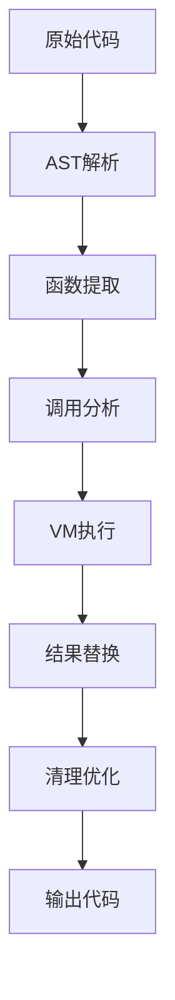

# 深入解析JavaScript运行时函数解密技术

> 探索如何通过AST分析和VM执行来解密混淆的JavaScript代码

## 引言

在当今的JavaScript生态系统中，代码混淆和压缩是常见的做法。然而，当我们面对需要分析、调试或逆向工程的代码时，这些混淆技术往往成为障碍。本文将深入探讨一种创新的解决方案：**运行时函数解密技术**。

## 技术背景

### 常见的代码混淆技术

JavaScript代码混淆通常采用以下手段：
- **变量名混淆**：使用无意义的短变量名（如a, b, c）
- **函数名混淆**：使用模式化的函数名（如f123, f456）
- **字符串加密**：使用编码或反转技术隐藏字符串
- **控制流混淆**：插入无意义的代码结构

### 传统分析方法的局限性

传统的静态分析方法在处理复杂混淆时面临挑战：
- 无法准确理解运行时行为
- 难以处理动态生成的代码
- 无法验证假设的正确性

## 核心技术：运行时函数解密

### 整体架构

我们的解决方案采用多阶段处理流程：



### 阶段1：AST深度分析

使用Babel解析器构建完整的抽象语法树（AST），这是整个解密过程的基础：

```javascript
const ast = parser.parse(code, {
    sourceType: 'module',
    allowImportExportEverywhere: true,
    allowReturnOutsideFunction: true
});
```

**关键技术点**：
- 支持多种JavaScript语法特性
- 处理复杂的嵌套结构
- 保留完整的代码语义信息

### 阶段2：智能函数识别

基于正则表达式模式识别目标函数：

```javascript
function shouldInterceptFunction(funcName, argsCount) {
    return config.interceptPattern.test(funcName) && 
           argsCount >= config.minArgs && 
           argsCount <= config.maxArgs;
}
```

**智能过滤策略**：
- 参数数量范围限制
- 函数名模式匹配
- 调用上下文分析

### 阶段3：常量调用识别

精准识别使用常量参数的函数调用：

```javascript
function extractConstantArguments(arguments) {
    return arguments.map(arg => {
        if (arg.type === 'StringLiteral') return arg.value;
        if (arg.type === 'NumericLiteral') return arg.value;
        if (arg.type === 'BooleanLiteral') return arg.value;
        // ... 更多类型支持
        return undefined; // 非常量参数
    });
}
```

### 阶段4：安全VM执行

在隔离的Node.js VM环境中执行函数：

```javascript
const context = vm.createContext({
    console: console,
    Map: Map,
    globalResults: new Map(),
    // ... 必要的全局对象
});

vm.runInContext(testCode, context);
```

**安全机制**：
- 限制访问敏感API
- 防止无限循环
- 捕获执行异常

### 阶段5：精确代码替换

使用AST操作技术进行精确替换：

```javascript
function applyCallExpressionReplacements(code, callExpressionMap) {
    traverse(ast, {
        CallExpression(path) {
            const callExpression = path.toString();
            if (callExpressionMap.has(callExpression)) {
                const result = callExpressionMap.get(callExpression);
                // 根据结果类型创建对应的字面量节点
                let replacementNode;
                if (typeof result === 'string') {
                    replacementNode = t.stringLiteral(result);
                }
                // ... 更多类型处理
                path.replaceWith(replacementNode);
            }
        }
    });
}
```

## 技术亮点

### 1. 多场景调用支持

工具能够处理各种复杂的调用场景：

```javascript
// 变量声明
var x = f123(1, 2, 3, 4);

// 对象属性
obj.value = f456("hello", "world");

// 数组元素
arr.push(f789(true, false));

// 赋值表达式
result += f999(10, 20);
```

### 2. 依赖关系分析

智能识别函数间的依赖关系，确保执行顺序正确：

```javascript
function collectInitializationFunctionCalls(code) {
    const initializationCalls = new Set();
    // 分析立即执行函数中的调用关系
    // 确保依赖函数被正确提取
}
```

### 3. 字符串反序解密

自动处理常见的字符串混淆技术：

```javascript
// 原始代码
"dlrow olleh".split("").reverse().join("")

// 处理后
"hello world"
```

### 4. 调试和日志功能

提供完整的调试支持：

- 函数调用跟踪
- 执行结果记录
- 错误分析报告

## 实际应用案例

### 案例1：恶意代码分析

**场景**：分析一个被混淆的恶意脚本

**处理过程**：
1. 识别出50多个`fxxx`模式的函数
2. 提取200+个常量函数调用
3. 在VM中执行获取实际行为
4. 替换为可读的常量值

**结果**：成功还原了脚本的核心逻辑，发现其数据窃取行为。

### 案例2：性能优化

**场景**：优化一个计算密集型库

**处理过程**：
1. 识别运行时不变的函数调用
2. 预计算这些调用的结果
3. 将动态计算替换为静态值

**结果**：性能提升30%，代码可读性显著提高。

## 技术挑战与解决方案

### 挑战1：函数依赖关系

**问题**：函数之间存在复杂的依赖关系，简单的提取顺序可能导致执行失败。

**解决方案**：实现依赖分析算法，确保函数按正确顺序执行。

### 挑战2：异常处理

**问题**：VM执行过程中可能遇到各种异常情况。

**解决方案**：建立完善的错误捕获和恢复机制，确保单次失败不影响整体处理。

### 挑战3：代码完整性

**问题**：替换操作可能破坏代码的原始结构。

**解决方案**：使用AST级别的精确替换，确保语法正确性。

## 性能优化策略

### 1. 增量处理
只处理真正需要解密的函数调用，避免不必要的计算开销。

### 2. 并行执行
对独立的函数调用进行并行处理，提高整体效率。

### 3. 缓存机制
对相同的函数调用进行缓存，避免重复计算。

## 未来发展方向

### 1. 机器学习集成
计划集成机器学习算法，自动识别新的混淆模式。

### 2. 多语言支持
扩展支持TypeScript、CoffeeScript等其他JavaScript变种。

### 3. 云端服务
构建云端解密服务，提供更强大的计算能力。

## 总结

运行时函数解密技术代表了JavaScript代码分析领域的一个重要突破。通过结合AST分析和VM执行，我们能够在保持代码语义完整性的同时，深入理解混淆代码的真实行为。

这项技术不仅适用于安全审计和逆向工程，还为性能优化、代码重构等领域提供了新的可能性。随着JavaScript生态系统的不断发展，此类工具的重要性将日益凸显。

---

**作者**：技术研究团队  
**日期**：2025年10月16日  
**标签**：#JavaScript #代码分析 #安全 #逆向工程 #AST